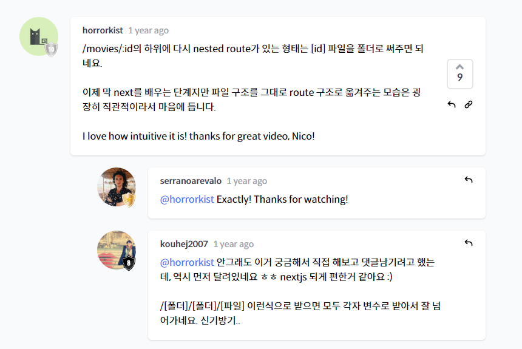
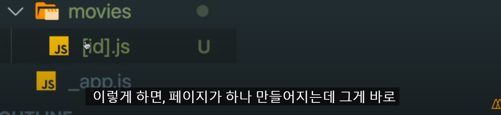
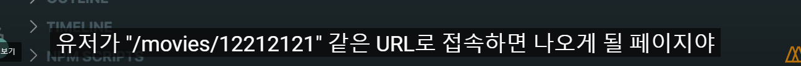

# NextJS Practice

- 라이브러리와 프레임워크의 주요 차이점

  라이브러리와 프레임워크의 주요 차이점은 "Inversion of Control"(통제의 역전)입니다.
  라이브러리에서 메서드를 호출하면 사용자가 제어할 수 있습니다.
  그러나 프레임워크에서는 제어가 역전되어 프레임워크가 사용자를 호출합니다.

  라이브러리

  - 사용자가 파일 이름이나 구조 등을 정하고, 모든 결정을 내림
  - 우리가 가져다가 쓰는것

  프레임워크

  - 파일 이름이나 구조 등을 정해진 규칙에 따라 만들고 따름
  - 정해진 틀안에서 커스터마이징


***

- pages 폴더 안에 있는 파일명에 따라 route가 결정된다.

pages/about.js 생성 ->
localhost:3000/about (O)
localhost:3000/about-us(X)

다만 예외사항으로, index.js의 경우에는
앱이 시작하는 파일이라고 보면 된다.
즉 localhost:3000 그 자체다 뒤에 /index 로 붙이면 안된다.

이 강의를 들을 때는 import react from "react"를 쓸 필요가 없다.
다만 useState,useEffect, lifecycle method 같은 애들을 써야 할 경우에는 꼭 import를 해줘야 한다.


***

No HTML link for pages

페이지 간 클라이언트 측 경로 전환을 활성화하고 single-page app 경험을 제공하려면 Link컴포넌트가 필요합니다.
\```
// 변경 전
< a href="/about">About Us< /a>

// 변경 후
import Link from 'next/link'

< Link href="/about">
About Us
< /Link>
\```
https://nextjs.org/docs/messages/no-html-link-for-pages

useRouter()
앱의 함수 컴포넌트에서 router객체 내부에 접근하려면 userRouter()훅을 사용할 수 있습니다.
useRouter는 React Hook입니다. 즉, 클래스와 함께 사용할 수 없습니다. withRouter를 사용하거나 클래스를 함수 컴포넌트로 래핑할 수 있습니다.
\```
const router = useRouter()
\```
https://nextjs.org/docs/api-reference/next/router#userouter

***

## styled-jsx를 사용하는 컴포넌트는 다음과 같습니다.
\```
< style jsx>{`
CSS 스타일..
`}< /style>
\```
styled-jsx
https://github.com/vercel/styled-jsx

Adding Component-Level CSS
Next.js는[name].module.css 파일 명명 규칙을 사용하여 CSS Module을 지원합니다.

Sass Support
Next.js를 사용하면.scss 및.sass 확장자를 모두 사용하여 Sass를 가져올 수 있습니다.


- 이렇게 변수명도 사용할 수 있다

***

## Layouts
React 모델을 사용하면 페이지를 일련의 컴포넌트로 분해할 수 있습니다. 이러한 컴포넌트 중 많은 부분이 페이지 간에 재사용되는 경우가 많습니다. 예를 들어 모든 페이지에 동일한 navigation과 footer가 있을 수 있습니다.
https://nextjs.org/docs/basic-features/layouts

Head (next/head)
페이지 head에 엘리먼트를 추가하기 위한 내장 컴포넌트를 노출합니다.
head에 태그가 중복되지 않도록 하려면 다음 예제와 같이 태그가 한 번만 렌더링되도록 하는 key 속성을 사용할 수 있습니다.
이 경우 두 번째 meta property="og:title"만 렌더링됩니다. 중복 키 속성이 있는 메타 태그는 자동으로 처리됩니다..
\```
// key를 지정해주지 않으면 meta og:title가 중복해서 2번 랜더링됩니다.
// (title은 지정하지 않아도 2번 랜더링 되지 않음)
< Head>
< title>My page title< /title>
< meta property="og:title" content="My page title" key="title" />
< /Head>
< Head>
< meta property="og:title" content="My new title" key="title" />
< /Head>
\```
https://nextjs.org/docs/api-reference/next/head

IMDB Mobile App Design 이미지
https://dribbble.com/shots/11413278-Imdb-mobile-app-design


***

## Image (No Img Element)
HTML img 엘리먼트가 이미지를 표시하는 데 사용되었습니다. 더 나은 성능과 자동 이미지 최적화를 위해 Next.js의 내장 Image 컴포넌트를 사용하십시오.
\```
import Image from 'next/image'

< Image
src="https://example.com/test"
alt="Landscape picture"
width={500}
height={500}
/>
\```
https://nextjs.org/docs/messages/no-img-element

***

## fetch

next.config.js
Next.js에서 커스텀 설정을 하기 위해서는 프로젝트 디렉터리의 루트(package.json 옆)에 next.config.js 또는 next.config.mjs 파일을 만들 수 있습니다. next.config.js는 JSON 파일이 아닌 일반 Node.js 모듈입니다.
Next.js 서버 및 빌드 단계에서 사용되며 브라우저 빌드에는 포함되지 않습니다.
https://nextjs.org/docs/api-reference/next.config.js/introduction

Redirects (URL변경됨)
Redirect을 사용하면 들어오는 request 경로를 다른 destination 경로로 Redirect할 수 있습니다. Redirect을 사용하려면 next.config.js에서 redirects 키를 사용할 수 있습니다.

redirects은 source, destination 및 permanent 속성이 있는 객체를 포함하는 배열을 반환하는 비동기 함수입니다.
source: 들어오는 request 경로 패턴 (request 경로)
destination: 라우팅하려는 경로 (redirect할 경로)
permanent: true인 경우 클라이언트와 search 엔진에 redirect를 영구적으로 cache하도록 지시하는 308 status code를 사용하고, false인 경우 일시적이고 cache되지 않은 307 status code를 사용합니다.
https://nextjs.org/docs/api-reference/next.config.js/redirects

Rewrites (URL변경되지 않음)
Rewrites를 사용하면 들어오는 request 경로를 다른 destination 경로에 매핑할 수 있습니다.
Rewrites은 URL 프록시 역할을 하고 destination 경로를 mask하여 사용자가 사이트에서 위치를 변경하지 않은 것처럼 보이게 합니다. 반대로 redirects은 새 페이지로 reroute되고 URL 변경 사항을 표시합니다.
https://nextjs.org/docs/api-reference/next.config.js/rewrites

Movie Poster Path
https://image.tmdb.org/t/p/w500/${movie.poster_path}

주의! fetch할 때 /api/movies 또는 http://localhost:3000/api/movies 둘 다 가능하지만 http가 아닌 https로 fetch하게 되면 오류가 발생합니다.

--------------------------------

혹시 파라미터 관련해서 저같은 문제를 겪을 지도 모르는 분을 위해 댓글 남겨봅니다.
fetch를 할 때 파라미터를 여러 개 붙여서 요청한다면 이런 식일 겁니다.
fetch(`/api/foo=bar&key=val`)
그리고 config에서 rewrite를 이렇게 해주죠.
{
source: "/api/:params",
destination: `https://some.api/items?key=${API_KEY}&:params`
}
그런데 무슨 문제가 생기냐면, destination에서 "&:" 부분을 그대로 인식하지 않고 "&__ESC_COLON_" 이라는 문자열로 바꿔버립니다.
그렇기 때문에 destination을 다음과 같이 바꿔주어야 합니다.
`https://some.api/items?key=${API_KEY}${encodeURIComponent("&")}:params`
이렇게 하면 :params로 넘어온 문자열이 &와 문제없이 결합합니다.

***

getServerSideProps


- 무엇이 나을까?


```typescript
// 타입스크립트 코드
import { GetServerSideProps, InferGetServerSidePropsType } from "next";

interface IMovieProps {
  id: number;
  backdrop_path: string;
  original_title: string;
  overview: string;
  poster_path: string;
  title: string;
  vote_average: number;
  genre_ids: [number];
}

function Home({ results }: InferGetServerSidePropsType<GetServerSideProps>) {
  return (
    <div className="container">
      {results?.map((movie: IMovieProps) => (
        <div className="movie" key={movie.id}>
          
          <h4>{movie.original_title}</h4>
        </div>
      ))}
    </div>
  );
  ``;
}

/* export const getServerSideProps: GetServerSideProps = async () => {
  ...
}; */

export async function getServerSideProps({}: GetServerSideProps) {
  const { results } = await (
    await fetch(`http://localhost:3000/api/movies`)
  ).json();
  return {
    props: {
      results,
    },
  };
}

export default Home;
```

getServerSideProps
page에서 서버 측 랜더링 함수인 getServerSideProps함수를 export하는 경우 Next.js는 getServerSideProps에서 반환된 데이터를 사용하여 각 request에서 이 페이지를 pre-render합니다. getServerSideProps는 서버 측에서만 실행되며 브라우저에서는 실행되지 않습니다.
https://nextjs.org/docs/basic-features/data-fetching/get-server-side-props

getServerSideProps를 사용하여 request시 데이터 fetch하기
다음 예는 request 시 데이터를 fetch하고 결과를 pre-render하는 방법을 보여줍니다.
(fetch할 때 오류 뜨시는 분들은 https를 http로 바꿔주시면 됩니다.)
\```
export default function Home({ data }) {
// 데이터 랜더링
}

// 매 request마다 실행됩니다.
export async function getServerSideProps() {
const res = await fetch(`https://.../data`);
const data = await res.json();

// props를 통해 page에 data전달
return { props: { data } }
}
\```
https://nextjs.org/docs/basic-features/data-fetching/get-server-side-props#using-getserversideprops-to-fetch-data-at-request-time

getServerSideProps (타입스크립트와 함께 사용하기)
https://nextjs.org/docs/api-reference/data-fetching/get-server-side-props#getserversideprops-with-typescript


## SEO가 필요한 페이지에 SSR을 적용하면 된다


### getServerSideProps 추가 설명
https://nextjs.org/docs/basic-features/data-fetching/get-server-side-props

언제 getServerSideProps를 사용해야 하나요?
request time에 반드시 데이터를 fetch해와야 하는 페이지를 pre-render해야 하는 경우에만 getServerSideProps를 사용해야 합니다.
데이터를 pre-render할 필요가 없다면 client side에서 데이터를 가져오는 것을 고려해야 합니다.

클라이언트 측에서 데이터 가져오는 과정 (Fetching data on the client side)
페이지에 자주 업데이트되는 데이터가 포함되어 있고 데이터를 pre-render할 필요가 없는 경우 클라이언트 측에서 데이터를 가져올 수 있습니다.
\1. 먼저 데이터가 없는 페이지를 즉시 표시합니다.
\2. 페이지의 일부는 Static Generation을 사용해 pre-render할 수 있습니다.
\3. 없는 데이터를 위해 loading 상태를 표시할 수 있습니다.
\4. 그런 다음 클라이언트 측에서 데이터를 가져와 준비가 되면 표시합니다.

이 접근 방식은 예를 들어 사용자 대시보드 페이지에 적합합니다.
왜냐하면 대시보드는 사용자별 비공개 페이지이기 때문에 SEO와는 관련이 없으며 페이지를 미리 렌더링할 필요가 없습니다. 또한 데이터는 자주 업데이트되므로 요청 시 데이터를 가져와야 합니다.

getServerSideProps가 오류 페이지를 렌더링합니까?
getServerSideProps 내부에서 오류가 발생하면 pages/500.js 파일이 표시됩니다.
500 page(서버 렌더링 오류 페이지)는 사용자가 커스터 마이징 할 수 있습니다.
개발 중에는 이 파일이 사용되지 않고 대신 개발 오버레이가 표시됩니다.

***

## Router



````react
Dynamic Routes
Next.js에서는 page에 대괄호([param])를 추가하여 Dynamic Route를 생성할 수 있습니다.
/movies/1, /movies/abc 등과 같은 모든 경로는 pages/movies/[id].js와 일치합니다.
```
const router = useRouter()
const { id } = router.query
```
https://nextjs.org/docs/routing/dynamic-routes

Catch all routes
대괄호 안에 세 개의 점(...)을 추가하여 모든 경로를 포착하도록 Dynamic Routes를 확장할 수 있습니다. pages/movies/[...id].js는 /movies/1와 일치하지만 /movies/1/2, /movies/1/ab/cd 등과도 일치합니다. 일치하는 매개변수는 페이지에 쿼리 매개변수로 전송되며 항상 배열이므로 /movies/a 경로에는 다음 쿼리 개체가 있습니다.
ex) { "id": ["a"] }
https://nextjs.org/docs/routing/dynamic-routes#catch-all-routes
````





***

## Router Push

````react
router.push(url, as, options)

클라이언트 측 전환을 처리합니다. 이 방법은 next/link가 충분하지 않은 경우에 유용합니다.
url: UrlObject | String: 탐색할 URL
as: UrlObject | String: 브라우저 URL 표시줄에 표시될 경로에 대한 선택적 데코레이터입니다.
```
router.push({
pathname: '/post/[pid]',
query: { pid: post.id },
})
```
+ 외부 URL에 대해서는 router.push()를 사용할 필요가 없습니다.
window.location을 사용하는 것이 더 적합합니다.
https://nextjs.org/docs/api-reference/next/router#routerpush

Movie Detail API
API: https://api.themoviedb.org/3/movie/{movie_id}?api_key=api_key&language=en-US
https://developers.themoviedb.org/3/movies/get-movie-details
````


- router push로 했을때 url 마스킹 하는방법(push에 올려보면 다 나온다)


- router.push로 url데이터 전달하는거와 같이 Link 컴포넌트도 가능


***

## catch all url

```react
// 타입스크립트로 쓰는 것
type MovieDetailParams = [string, string];

const router: NextRouter = useRouter();
const [title, id] = (router.query.params || []) as MovieDetailParams;
```


````react
getServerSideProps
페이지에서 getServerSideProps(서버 측 렌더링)라는 함수를 export하는 경우 Next.js는 getServerSideProps에서 반환된 데이터를 사용하여 각 request에서 이 페이지를 pre-render합니다.
https://nextjs.org/docs/basic-features/data-fetching/get-server-side-props

getServerSideProps (Context parameter)
params: 이 페이지에서 dynamic route(동적 경로)를 사용하는 경우 params에 route parameter가 포함됩니다. 페이지 이름이 [id].js이면 params는 { id: ... }처럼 보일 것입니다.
query: 쿼리 문자열을 나타내는 객체입니다.
https://nextjs.org/docs/api-reference/data-fetching/get-server-side-props#context-parameter

getServerSideProps (타입스크립트와 함께 사용하기)
```
import { GetServerSideProps } from 'next'

export const getServerSideProps: GetServerSideProps = async (context) => {
// ...
}

function Page({ data }: InferGetServerSidePropsType< typeof getServerSideProps>)
```
https://nextjs.org/docs/api-reference/data-fetching/get-server-side-props#getserversideprops-with-typescript

router.query.params 타입 지정 (타입스크립트)
```
type MovieDetailParams = [string, string] | [];

const router: NextRouter = useRouter();
const [title, id] = (router.query.params || []) as MovieDetailParams;
````


- router에 들어있는 영화제목과 id를 얻기위해 getServerSideProps를 쓸수있다