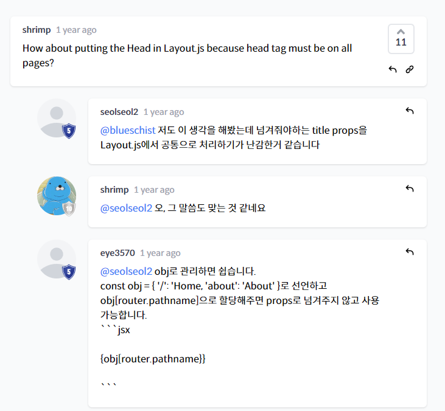

# NextJS Practice

- 라이브러리와 프레임워크의 주요 차이점

  라이브러리와 프레임워크의 주요 차이점은 "Inversion of Control"(통제의 역전)입니다.
  라이브러리에서 메서드를 호출하면 사용자가 제어할 수 있습니다.
  그러나 프레임워크에서는 제어가 역전되어 프레임워크가 사용자를 호출합니다.

  라이브러리

  - 사용자가 파일 이름이나 구조 등을 정하고, 모든 결정을 내림
  - 우리가 가져다가 쓰는것

  프레임워크

  - 파일 이름이나 구조 등을 정해진 규칙에 따라 만들고 따름
  - 정해진 틀안에서 커스터마이징


***

- pages 폴더 안에 있는 파일명에 따라 route가 결정된다.

pages/about.js 생성 ->
localhost:3000/about (O)
localhost:3000/about-us(X)

다만 예외사항으로, index.js의 경우에는
앱이 시작하는 파일이라고 보면 된다.
즉 localhost:3000 그 자체다 뒤에 /index 로 붙이면 안된다.

이 강의를 들을 때는 import react from "react"를 쓸 필요가 없다.
다만 useState,useEffect, lifecycle method 같은 애들을 써야 할 경우에는 꼭 import를 해줘야 한다.


***

No HTML link for pages

페이지 간 클라이언트 측 경로 전환을 활성화하고 single-page app 경험을 제공하려면 Link컴포넌트가 필요합니다.
\```
// 변경 전
< a href="/about">About Us< /a>

// 변경 후
import Link from 'next/link'

< Link href="/about">
About Us
< /Link>
\```
https://nextjs.org/docs/messages/no-html-link-for-pages

useRouter()
앱의 함수 컴포넌트에서 router객체 내부에 접근하려면 userRouter()훅을 사용할 수 있습니다.
useRouter는 React Hook입니다. 즉, 클래스와 함께 사용할 수 없습니다. withRouter를 사용하거나 클래스를 함수 컴포넌트로 래핑할 수 있습니다.
\```
const router = useRouter()
\```
https://nextjs.org/docs/api-reference/next/router#userouter

***

## styled-jsx를 사용하는 컴포넌트는 다음과 같습니다.
\```
< style jsx>{`
CSS 스타일..
`}< /style>
\```
styled-jsx
https://github.com/vercel/styled-jsx

Adding Component-Level CSS
Next.js는[name].module.css 파일 명명 규칙을 사용하여 CSS Module을 지원합니다.

Sass Support
Next.js를 사용하면.scss 및.sass 확장자를 모두 사용하여 Sass를 가져올 수 있습니다.


- 이렇게 변수명도 사용할 수 있다

***

Layouts
React 모델을 사용하면 페이지를 일련의 컴포넌트로 분해할 수 있습니다. 이러한 컴포넌트 중 많은 부분이 페이지 간에 재사용되는 경우가 많습니다. 예를 들어 모든 페이지에 동일한 navigation과 footer가 있을 수 있습니다.
https://nextjs.org/docs/basic-features/layouts

Head (next/head)
페이지 head에 엘리먼트를 추가하기 위한 내장 컴포넌트를 노출합니다.
head에 태그가 중복되지 않도록 하려면 다음 예제와 같이 태그가 한 번만 렌더링되도록 하는 key 속성을 사용할 수 있습니다.
이 경우 두 번째 meta property="og:title"만 렌더링됩니다. 중복 키 속성이 있는 메타 태그는 자동으로 처리됩니다.
\```
// key를 지정해주지 않으면 meta og:title가 중복해서 2번 랜더링됩니다.
// (title은 지정하지 않아도 2번 랜더링 되지 않음)
< Head>
< title>My page title< /title>
< meta property="og:title" content="My page title" key="title" />
< /Head>
< Head>
< meta property="og:title" content="My new title" key="title" />
< /Head>
\```
https://nextjs.org/docs/api-reference/next/head

IMDB Mobile App Design 이미지
https://dribbble.com/shots/11413278-Imdb-mobile-app-design

